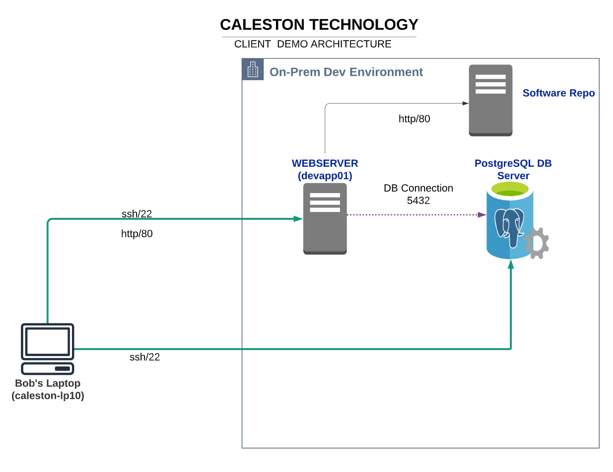

# Firewall Setup for devapp01

This setup secures the **devapp01** web server using `iptables`.



## 🛠 Instructions

1. **Copy the script** to the server:

   ```bash
   scp setup_iptables.sh bob@devapp01:/tmp/
   ```

2. **SSH into the server:**

   ```bash
   ssh bob@devapp01
   ```

3. **Switch to root and run the script:**

   ```bash
   sudo bash /tmp/setup_iptables.sh
   ```

4. **Verify the rules:**
   ```bash
   sudo iptables -L -v
   sudo iptables -S
   ```

---

## 🔒 Rules Summary

### Incoming (INPUT)

| Source IP      | Port | Protocol | Action | Description             |
| -------------- | ---- | -------- | ------ | ----------------------- |
| 172.16.238.187 | 22   | TCP      | ACCEPT | SSH from Bob's Laptop   |
| 172.16.238.187 | 80   | TCP      | ACCEPT | HTTP from Bob's Laptop  |
| Any            | Any  | Any      | DROP   | Drop all other incoming |

### Outgoing (OUTPUT)

| Destination   | Port   | Protocol | Action | Description                |
| ------------- | ------ | -------- | ------ | -------------------------- |
| 172.16.238.11 | 5432   | TCP      | ACCEPT | PostgreSQL to devdb01      |
| 172.16.238.15 | 80     | TCP      | ACCEPT | HTTP to caleston-repo-01   |
| google.com    | 443    | TCP      | ACCEPT | HTTPS to Google            |
| Any           | 80/443 | TCP      | DROP   | Drop all other web traffic |

---

## 💾 Save & Persist Rules

On Debian/Ubuntu:

```bash
sudo apt install iptables-persistent -y
sudo netfilter-persistent save
```

On RHEL/CentOS:

```bash
service iptables save
chkconfig iptables on
```

---

## 🧩 Verification Commands

```bash
sudo iptables -L -n -v
sudo iptables-save
```

[**🔗 Challenge Link**](https://kodekloud.com/free-labs/linux/iptables)
