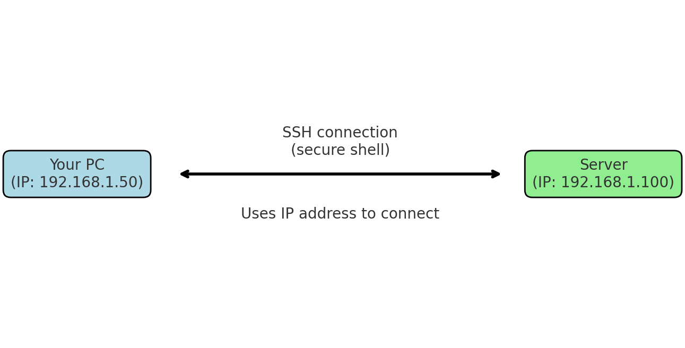

# Difference Between Changing IP and SSH

This document explains the key differences between **changing an IP address** and using **SSH**.

---

## 🔹 Changing IP
- **Definition:** Modifying the IP address of your machine (server or client).  
- **Purpose:** Determines how your computer is identified and communicates on a network.  
- **Scope:** Networking layer (OSI Layer 3 – Internet Layer).  

**Example:**
```bash
sudo ip addr add 192.168.1.100/24 dev eth0
```

---

## 🔹 SSH (Secure Shell)
- **Definition:** A protocol for securely connecting to another computer over a network.  
- **Purpose:** Provides encrypted remote login and command execution.  
- **Scope:** Application layer (OSI Layer 7).  

**Example:**
```bash
ssh user@192.168.1.100
```

---

## 🔹 Key Differences

| Feature            | Change IP Address | SSH |
|--------------------|------------------|-----|
| **Definition**     | Assigns/changes your system’s network address | Securely connects to a remote system |
| **Layer**          | Network layer (IP routing, addressing) | Application layer (remote shell, encryption) |
| **Effect**         | Affects how others can reach your machine | Lets you remotely control another machine |
| **Persistence**    | Temporary or permanent (config file) | Temporary (per connection) |
| **Dependency**     | Independent of SSH | Needs IP (or hostname) of the target machine |

---

## 🔹 Visual Diagram

The diagram below shows how changing IP and SSH fit together in a network:



- **Change IP** = tells the network *“this is my new address.”*  
- **SSH** = says *“connect me securely to another machine at that address.”*  
